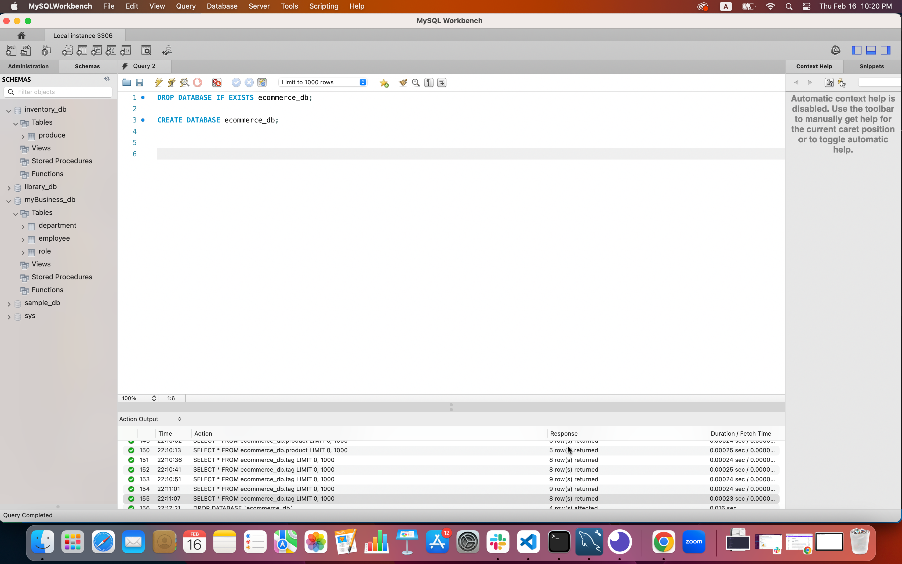
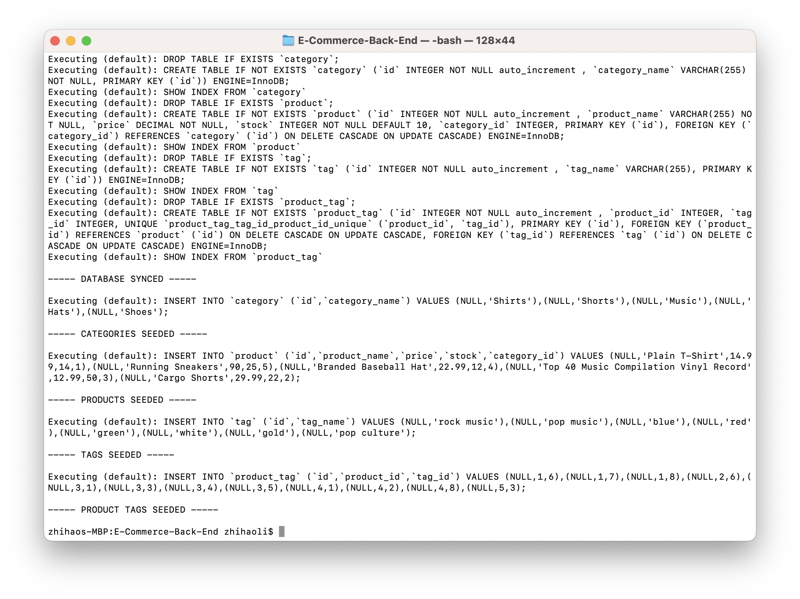
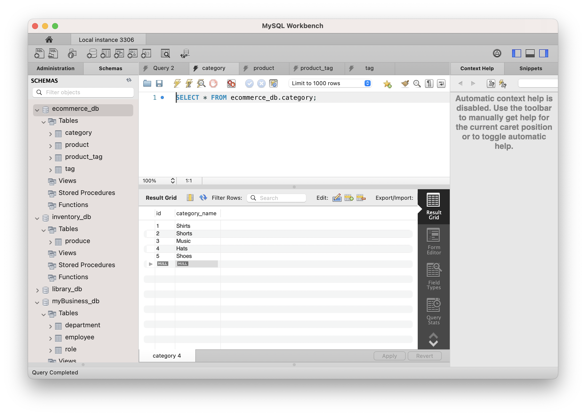
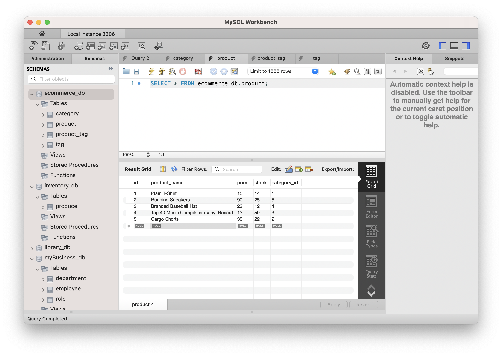
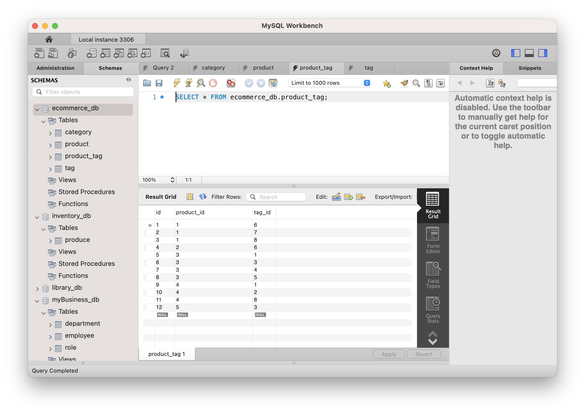
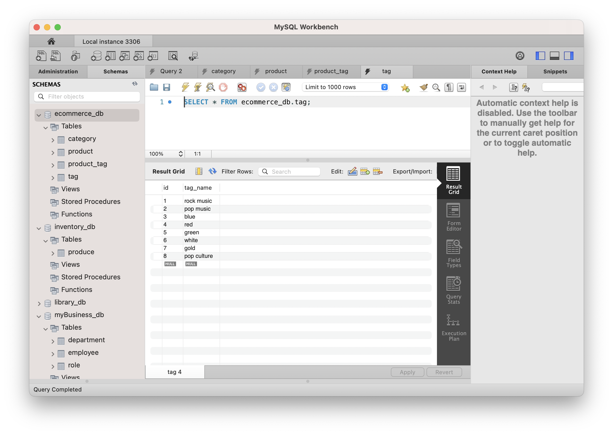
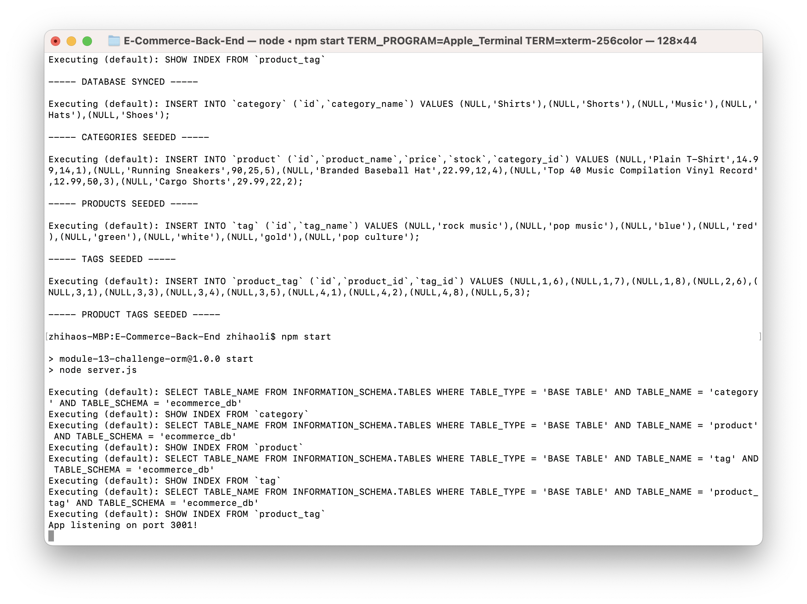
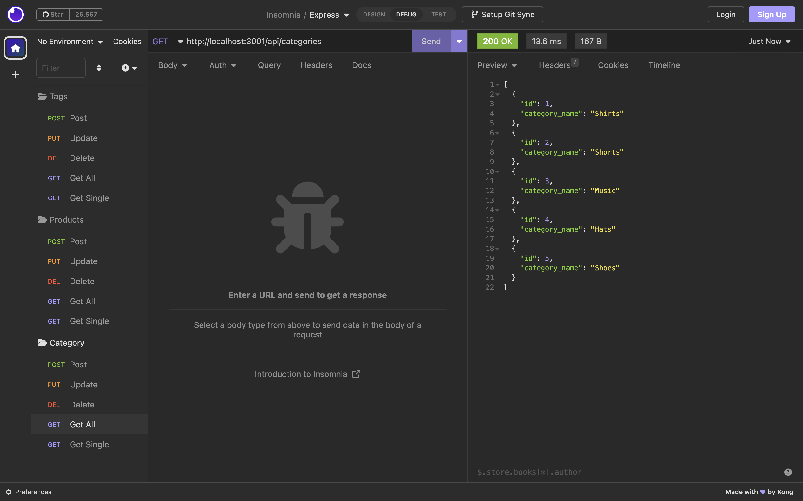

# E-Commerce Back End

## Description
The project is to build the back end for an e-commerce site. This back end application can configure a working Express.js API by using Sequelize to interact with a MySQL database.

## Table of Contents
1. [Installation](#Installation)
2. [Usage](#Usage)
3. [Contributing](#Contributing)
4. [License](#License)
5. [Tests](#Tests)
6. [Questions](#Questions)
7. [Screenshots](#Screenshots)
8. [Walkthrough Video](#Walkthrough)

## Installation 
1. Install package.json with command `npm i`

## Usage 
1. Opening an external ternimal from the repository
2. Create the schema by running the code `schema.sql` in MySQL Workbench 
2. Seed the MySQL database with command `npm run seed`
3. Start the server with command: `npm start` 

## Contributing 

### Zhihao Li
https://github.com/lzh1990214/E-Commerce-Back-End

### MySQL2
https://www.npmjs.com/package/mysql2

### Sequelize
https://sequelize.org/

### Dotenv
https://www.npmjs.com/package/dotenv

### Express.js
https://expressjs.com/

## License 
UNLICENSED

## Tests 
N/A

## Questions 

### Github 
https://github.com/lzh1990214

### Email
zli02@alumni.risd.edu

## Screenshots 

### Create schema in MySQL

### Seed the database

### Category table

### Product table

### Product-tag table

### Tag table

### Start server

### Routes test with Insomnia

## Walkthrough Video 
https://youtu.be/zjx0zT_e5dg
